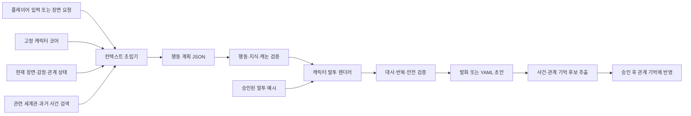

# AI 캐릭터 채팅의 일관성 설계 리서치

> 조사 기준일: 2026-08-13
>
> 목적: 상용 AI 캐릭터 채팅 서비스의 공개 설정과 일관성 유지 방식을 비교하고, Love Office의 저작 도구 및 향후 캐릭터 채팅에 적용할 설계를 제안한다.

## 결론

Love Office에 가장 맞는 방향은 **고정된 캐릭터 코어 + 상황별 행동 상태 + 검색되는 세계관/기억 + 예시 기반 말투 + 생성 전후 검증**의 하이브리드 구조다.

동반자형 서비스처럼 사용자의 반응으로 캐릭터 정체성 자체를 계속 바꾸면 장기 애착에는 유리할 수 있지만, 반전과 객관적 진실이 중요한 서사 IP에는 위험하다. Love Office에서는 다음을 분리해야 한다.

- 캐릭터 코어: 작가만 바꾸는 불변 사실, 가치, 동기, 경계, 기본 화법
- 현재 상태: 장면, 감정, 목표, 관계, 알고 있는 사실
- 적응 영역: 플레이어와 겪은 사건, 약속, 호칭, 아직 끝나지 않은 화제
- 캐논: `story/`와 `story/world/`만 권위가 있으며 AI가 자동 수정하지 않음
- 생성 결과: 캐논이 아니라 검수 대상 초안 또는 별도 비정사 대화 기록

우선순위는 라이브 채팅 추가보다 **현재 AI 저작 컨텍스트 슬림화, 캐릭터별 기준 대사, 자동 일관성 테스트**가 먼저다. 이 세 가지는 현재 게임의 대사 품질에도 즉시 도움이 되고, 나중에 라이브 채팅을 만들 때 그대로 재사용할 수 있다.

## 조사 범위와 주의점

비교 대상은 국내 대중형 서비스인 제타, 대규모 UGC 플랫폼인 Character.AI, 동반자형 서비스인 Kindroid·Nomi·Replika, 게임/미디어용 개발 플랫폼인 Inworld다.

각 회사가 공개한 설정 화면, 도움말, 제품 설명, 기술 문서만 근거로 삼았다. 소비자 서비스의 실제 시스템 프롬프트, 검색 점수, 모델 학습 데이터, 생성 후 필터는 대부분 비공개이므로 이 문서에서 말하는 내부 작동은 공개 설명을 넘어서 단정하지 않는다. 제타는 특히 상세 기술 공개가 적어 제품 표면만 비교한다.

## 서비스별 공개 설정과 일관성 장치

| 서비스 | 사용자가 설정하는 핵심 항목 | 공개된 일관성 장치 | Love Office에 주는 시사점 |
| --- | --- | --- | --- |
| 제타 | 캐릭터, 이미지, 특징, 세계관, 말투 | 자체 감성 대화 모델을 파인튜닝하며 단기 기억과 반복·엉뚱한 응답 문제를 지속 개선한다고 설명한다. 상세 메모리 구조는 비공개다. | 한국어 장르 문법과 빠른 캐릭터 생성 UX는 참고하되, 설정 입력만으로 캐논을 지킬 수 있다고 가정하면 안 된다. |
| Character.AI | 이름, 아바타, 태그라인, 설명, 첫 인사, 추천 시작 문장, 음성, 자유 형식 Definition, 예시 대화, 사용자 Persona | Story Memory, 고정/자동 Facts, 핀, 대화 기록 압축, 키워드로 관련 항목만 여는 Lorebook, 역할극용 모델 개선을 함께 사용한다. | 캐릭터 정의·말투 예시·사용자 역할·세계관·대화 기억을 서로 다른 슬롯으로 분리해야 한다. |
| Kindroid | Backstory, 최우선 Response Directive, Key Memories, Example Message, Journal, 사용자 Persona, 그룹 컨텍스트, 모델 Flair, Dynamism | 항상 포함되는 지속 메모리, 단·중기 Cascaded Memory, 관련성 기반 장기 기억, 키프레이즈 기반 Journal을 구분한다. 긴 Backstory가 최근 대화 공간을 잠식한다고 명시한다. | 가장 직접적인 참고 모델이다. 특히 “행동 코어 / 최우선 출력 지시 / 말투 예문 / 검색 기억” 분리가 유용하다. |
| Nomi | 초기 성격·관심사·관계 유형, Backstory, Boundaries, Preferences, Desires, Current Roleplay, Nicknames, Appearance, 강한 Inclinations, Communication Style | 단·중·장기 기억, 스스로 중요한 정체성 정보를 갱신하는 Identity Core, 장기 기억을 연결하는 Mind Map, 사용자 피드백을 사용한다. | 행동 일관성은 단순 사실 기억이 아니라 “이 인물은 왜 그렇게 행동하는가”를 요약한 정체성 층이 필요하다. 단, Love Office에서는 자동 변형을 승인제로 바꿔야 한다. |
| Replika | Backstory, 성격 Traits, 관심사 지식 팩, 관계 상태, 사용자 프로필, 수동/자동 Memory | 보이는 사실 기억과 전체 대화 패턴을 보는 더 깊은 기억을 함께 사용하고, 좋아요/싫어요와 반복적 강화로 성향을 조정한다. | 사용자 취향과 캐릭터 정체성을 같은 것으로 취급하지 말아야 한다. 피드백은 캐릭터 코어 변경보다 대화 품질·관계 기억 교정에 써야 한다. |
| Inworld | Character Profile, 초기 Emotion, 관계 속성, Goals, 검색 Knowledge, Knowledge Filter, 음성/전달 스타일 | 관련 지식만 검색하고, 지식 필터로 캐릭터가 알 수 있는 범위를 제한하며, 관계·감정·목표를 별도 상태로 둔다. 장기 대화는 외부 저장소와 세션 요약을 권한다. | Love Office의 구조화 상태 모델과 가장 잘 맞는다. 행동 결정과 문장 생성을 분리하고 `누가 무엇을 아는가`를 명시해야 한다. |

### 제타

제타의 공식 스토어 설명은 캐릭터의 **세계관과 말투**를 사용자가 설정하며 과거 대화와 취향을 기억한다고 안내한다. 스캐터랩은 이름·이미지·특징을 프롬프트에 반영하고 감성 대화용 자체 언어 모델을 파인튜닝했다고 공개했다. 최근 ML 인터뷰에서는 단기 기억만으로는 부족했고, 엉뚱한 말·반복·원하지 않는 반응을 줄이기 위한 모델 평가 지표를 운영한다고 설명한다.

- [제타 Google Play 설명](https://play.google.com/store/apps/details?id=com.scatterlab.messenger&hl=ko)
- [스캐터랩 제타 ML 리서처 인터뷰](https://blog.scatterlab.co.kr/interview-mlresearch)
- [제타의 모델·프롬프트 관련 카카오엔터프라이즈 사례](https://kakaoenterprise.com/press/%EC%8A%A4%EC%BA%90%ED%84%B0%EB%9E%A9-%EC%A0%9C%ED%83%80%EB%A5%BC-ai-%ED%8A%B9%ED%99%94-%EC%B9%B4%EC%B9%B4%EC%98%A4%ED%81%B4%EB%9D%BC%EC%9A%B0%EB%93%9C%EB%A1%9C/)

상세 메모리나 프롬프트 우선순위는 공개되지 않았다. 따라서 제타는 한국 시장의 상품·UX 기준으로는 중요하지만, 내부 아키텍처의 직접 근거로 사용하기는 어렵다.

### Character.AI

Character.AI의 Character Definition은 최대 32,000자의 자유 형식 필드이며, 공식 가이드는 가장 흔한 용도로 예시 대화를 든다. 중요한 내용을 앞에 쓰도록 권하고 긴 정의의 뒤쪽이 대화가 길어지며 잘릴 수 있다고 경고한다. 첫 인사는 캐릭터와 장면을 동시에 정하고, 사용자 Persona는 사용자 역할·성격·외형·취향을 캐릭터 정의와 분리한다.

2026년의 메모리 구조는 다음처럼 더 분명해졌다.

- Story Memory: 계속 유지할 배경·핵심 사건·특별한 순간
- Facts: Persona, 캐릭터, 조연별 자동 추출 사실과 사용자 편집
- Message history: 오래되면 정리·압축되는 대화 문맥
- Lorebook: 키워드가 등장할 때만 캐릭터·장소·사건·규칙 등의 관련 항목을 주입
- 모델 층: 장기 대화의 역할 유지, 반복 감소, 문맥 유지를 별도 모델 품질로 개선

이는 “모든 설정을 한 프롬프트에 넣기”보다 **정체성, 사용자 역할, 기억, 세계관 검색을 분리**하는 흐름을 보여 준다.

- [Character Definition](https://book.character.ai/character-book/character-attributes/definition)
- [Quick Creation의 설정 항목](https://book.character.ai/character-book/how-to-quick-creation)
- [User Personas](https://book.character.ai/character-book/user-personas)
- [2026 Story Memory·Facts·Memory Usage](https://blog.character.ai/memory/)
- [2026 Lorebook](https://blog.character.ai/lorebook/)
- [역할 유지·기억·반복 개선 모델 업데이트](https://blog.character.ai/pipsqueak2-and-more/)

### Kindroid

Kindroid는 공개 문서가 가장 구체적이다.

- Backstory: 성격, 역사, 기분, 행동, 사용자와의 관계
- Response Directive: 답변마다 가장 높은 우선순위로 적용되는 짧은 지시
- Key Memories: 항상 기억해야 하는 날짜·사실·사용자 정보
- Example Message: 말투, 시점, 인용부호, 길이와 형식의 기준 예시
- Journal: 특정 키프레이즈가 사용자 메시지에 있을 때만 검색되는 사건/설정
- Dynamism: 표현 다양성과 최근 문맥 안정성의 트레이드오프
- Model Flair: Companion, Roleplay, Narrative, Minimal 등 모델 해석 방식
- User Persona와 Group Context: 사용자 역할과 다인 장면의 공통 설정

메모리도 지속형, 중기 Cascaded, 검색형 장기 기억과 Journal로 나눈다. 공식 문서는 Backstory가 길수록 최근 대화에 쓸 공간이 줄고, 높은 Dynamism이 설정 준수를 약화할 수 있다고 밝힌다. 이 두 경고는 Love Office의 컨텍스트 예산과 생성 파라미터를 명시적으로 관리해야 한다는 근거다.

- [Kindroid personality 설정](https://kindroid.ai/docs/article/customizing-personality/)
- [Kindroid 메모리 구조](https://kindroid.ai/docs/article/memory/)
- [Chat Break와 컨텍스트 재설정](https://kindroid.ai/docs/article/chat-features-and-tools/)

### Nomi

Nomi의 Shared Notes는 Backstory, Boundaries, Preferences, Desires, Current Roleplay, Nicknames, Appearance, Inclinations 같은 역할별 슬롯을 둔다. 공개 Q&A에 따르면 Inclinations는 거의 매 응답에 드러나야 할 1~2개의 강한 스타일 지시에만 쓰고, Backstory와 Boundaries는 그다음으로 높은 우선순위를 갖는다.

Nomi의 특징은 Identity Core다. 단순 사건 기억 외에 가치, 성격, 습관, 중요한 관계 경험과 피드백을 “자신이 어떤 인물인가”라는 동적 요약으로 묶는다. Mind Map은 개별 장기 기억을 사람·장소·주제·목표 단위로 연결해 큰 맥락을 제공한다.

- [Shared Notes 개요](https://wiki.nomi.ai/What_are_shared_notes%3F)
- [Backstory Shared Note](https://wiki.nomi.ai/How_does_the_Backstory_shared_note_work%3F)
- [Shared Notes 우선순위와 단·중·장기 기억 설명](https://wiki.nomi.ai/2025_July_Q%26A_Summary)
- [Identity Core](https://nomi.ai/updates/introducing-the-nomi-identity-core-fostering-dynamic-and-authentic-identities/)
- [Mind Map 2.0](https://nomi.ai/updates/mind-map-2-0-bringing-nomi-memory-into-view/)

Nomi식 자동 성장 자체를 그대로 복제하는 것은 권하지 않는다. 사용자의 선호에 맞춰 인격이 변하는 동반자와, 작가가 통제하는 심리 스릴러 인물은 제품 목적이 다르다. Love Office에서는 Identity Core에 해당하는 요약은 **캐릭터 파일에서만 갱신**하고, 대화에서 추출된 변화는 관계 기억으로 격리해야 한다.

### Replika

Replika는 Backstory, 성격 Traits, 관심사 지식 팩, 관계 상태, 사용자 정보와 수동/자동 기억을 조합한다. Backstory는 이름을 쓴 3인칭, 간단한 긍정문, 반복적 강화가 권장된다. Memory는 사용자가 볼 수 있는 사실과 전체 대화 패턴에서 형성되는 더 깊은 개인화 층으로 설명된다. 좋아요/싫어요와 반복 대화가 성향을 강화한다.

- [Traits와 Interests](https://help.replika.com/hc/en-us/articles/360062096391-How-do-Traits-Interests-work)
- [Backstory 작성법](https://help.replika.com/hc/en-us/articles/37208430613261-How-your-Replika-s-backstory-shapes-its-personality)
- [다층 Memory](https://help.replika.com/hc/en-us/articles/37208679176077-How-does-Replika-s-memory-work)
- [관계 유형과 성장](https://help.replika.com/hc/en-us/articles/115001070951-What-is-Replika)

Replika가 보여 주는 핵심은 “사용자가 좋아하는 답변”과 “캐릭터가 원래 할 답변”의 긴장이다. Love Office에서는 사용자 반응이 말투 품질 개선에는 쓰일 수 있어도, 윤서아가 한도윤에게 연애 감정을 느끼지 않는다는 불변 사실 같은 캐논을 바꾸어서는 안 된다.

### Inworld

Inworld의 캐릭터 템플릿은 Character Profile과 별도로 Emotion, Relation State, Knowledge, Knowledge Filter, Goals를 둔다. 관계는 신뢰·존중·친밀함·유혹성·끌림 같은 속성으로 계산할 수 있고, Knowledge는 현재 발화와 관련 있을 때만 검색된다. Strict 필터를 쓰면 명시된 지식만 아는 캐릭터로 제한할 수 있다.

2026년 개발 가이드는 세션 내 대화와 세션 간 기억을 나누고, 후자는 `(user_id, character_id)`로 키를 분리한 외부 저장소에 요약해 다음 세션 프롬프트에 넣는 패턴을 제시한다. 캐릭터마다 시스템 프롬프트, 모델, 음성을 격리하는 것도 강조한다.

- [Inworld Character 템플릿](https://docs.inworld.ai/unreal-engine/runtime/templates/character)
- [AI Character Runtime 개요](https://docs.inworld.ai/guides/runtime-character)
- [2026 캐릭터 앱의 Persona·Memory 설계](https://inworld.ai/resources/voice-ai-for-ai-character-apps)

## 일관성을 만드는 공통 패턴

### 1. 행동 일관성은 “성격 형용사”가 아니라 의사결정 규칙에서 나온다

`친절함`, `차가움`, `소심함`만 적으면 상황마다 모델이 다르게 해석한다. 일관된 행동에는 최소한 다음이 필요하다.

- 변하지 않는 가치와 사실
- 장기 동기와 현재 목표
- 관계별 태도와 권력관계
- 감정/위험/피로 같은 현재 상태
- 특정 상황에서 무엇을 우선하고 무엇을 하지 않는지에 대한 규칙
- 현재 알 수 있는 사실과 아직 알면 안 되는 사실

Nomi의 Identity Core, Inworld의 Goal·Relation·Emotion, Love Office의 `emotion_rules`와 `interaction_preferences`가 모두 이 층을 다루고 있다.

### 2. 말투 일관성은 설명보다 예시의 힘이 크다

Character.AI의 Definition 예시 대화와 Kindroid의 Example Message는 공통적으로 실제 출력 형태를 보여 준다. 말투를 안정시키려면 다음을 함께 기록해야 한다.

- 높임말/반말과 호칭 규칙
- 평균 문장 길이와 한 응답의 문장 수
- 자주 쓰는 접속어·완곡어·단정어
- 감정이 높아질 때 바뀌는 리듬과 어휘
- 행동 묘사, 속말, 인용부호의 형식
- 잘못된 예와 금지 표현
- 안전한 동료, 상사, 한도윤 등 상대별 차이
- 여러 상황에서 승인된 실제 대사 예시

한 문장의 `register`만으로는 이 표면 형식을 안정적으로 재현하기 어렵다.

### 3. 기억은 한 종류가 아니다

상용 서비스는 이름은 달라도 대체로 다음 층으로 수렴한다.

| 층 | 내용 | 주입 방식 |
| --- | --- | --- |
| 고정 코어 | 정체성, 불변 사실, 경계, 기본 화법 | 항상 포함, 자동 변경 금지 |
| 작업 기억 | 최근 대화, 현재 장면, 현재 목표 | 거의 원문으로 유지 |
| 사건 기억 | 중요한 약속, 갈등, 선택, 관계 변화 | 요약·중요도·최근성으로 검색 |
| 의미 기억 | 취향, 관계, 반복 패턴, 인물에 대한 정리 | 구조화된 Facts/Identity 요약 |
| 세계관 지식 | 장소, 조직, 사건, 소품, 규칙 | 키워드 또는 의미 검색으로 필요한 항목만 포함 |

긴 캐릭터 프롬프트 하나에 전부 넣으면 최근 문맥이 줄고, 중요한 말투 규칙이 희석되며, 아직 알면 안 되는 설정이 새어 나올 수 있다.

### 4. 모델 하나만으로 해결하지 않는다

Character.AI와 제타는 역할극용 모델 학습과 반복 감소를 별도로 개선하고, Inworld는 캐릭터별 모델 선택과 A/B 테스트를 권한다. 그러나 서비스들이 동시에 메모리, 예시, 세계관 검색, 피드백 도구를 계속 추가하는 사실은 모델 성능만으로는 일관성이 완성되지 않는다는 뜻이다.

### 5. 일관성은 평가 세트가 있어야 유지된다

상용 서비스는 상세 지표를 거의 공개하지 않지만 제타와 Character.AI는 반복, 문맥 유지, 역할 이탈을 사용자 피드백과 실험으로 추적한다고 설명한다. 연구 쪽에서도 역할 프로필·지식·말투를 나눠 평가하거나, 장기 대화에서 다음 세 지표를 구분한다.

- prompt-to-line: 캐릭터 정의와 각 발화가 맞는가
- line-to-line: 앞뒤 발화가 서로 모순되지 않는가
- Q&A consistency: 같은 사실을 다른 표현으로 물어도 답이 유지되는가

참고 자료:

- [RoleLLM / RoleBench](https://arxiv.org/abs/2310.00746)
- [Generative Agents의 기억·성찰·계획 구조](https://arxiv.org/abs/2304.03442)
- [장기 다중 턴 Persona 일관성 평가](https://proceedings.neurips.cc/paper_files/paper/2025/hash/4c91443877f8388d8190c938ac5a4d4d-Abstract-Conference.html)
- [NLI를 이용한 Persona 모순 감소](https://aclanthology.org/2020.emnlp-main.65/)

## Love Office 현재 구조 평가

### 이미 잘 갖춘 부분

Love Office는 일반 캐릭터 채팅 서비스보다 캐논 통제가 강하다.

- `story/characters/*.yaml`: `immutable_facts`, `voice`, `interaction_preferences`, `emotion_rules`, `reporting_rules`, `relationships`
- `story/world/`: 회사·팀·직급·프로젝트·회의의 권위 있는 사실
- 장면의 `state_contract`, `effects`, 단일 `line`: 상태 변화와 플레이 문장의 분리
- `story_harness.py context`: 장면·캐스트·현재 상태·파생 감정·월드 컨텍스트를 묶는 기반
- `AI_AUTHORING_RULES.md`: 지식, 경계, 말투, 안전, 서사 불변 조건을 강제하는 계약
- 현재 작업 중인 `player_profile`: 취미·좋아하는 것·TMI 등을 안정 ID와 해금 기억으로 연결

특히 단일 플레이 문장과 객관적 `effects`, `interaction.target`과 `push_pull.target`을 분리한 설계는 캐릭터 반응과 주인공의 계산을 섞지 않게 하는 강력한 일관성 장치다.

### 보완이 필요한 부분

1. **말투가 얕다.** 현재 `voice`는 주로 `register`, `habits`, 일부 `forbidden`, `safe_context`만 가진다. 문장 길이, 호칭, 어휘, 감정별 변화, 상대별 변화, 승인 예시가 없다.
2. **기준 대사 코퍼스가 없다.** 출시 체크리스트에도 캐릭터별 대사 모아 읽기와 5~8개 기준 장면 지정이 미완료다.
3. **지식 공개 범위가 없다.** 월드 사실은 있지만 각 인물이 어느 시점에 무엇을 알고, 무엇을 모르며, 무엇을 숨기는지가 별도 정책으로 구조화되어 있지 않다.
4. **사건 기억과 열린 화제가 없다.** `progress.memories`는 현재 해금 중심이며, 대화 연속성을 위한 사건 요약·약속·미해결 질문·관계별 기억과는 역할이 다르다.
5. **대사 후검수가 없다.** 스키마·참조·상태 계약은 강하게 검증하지만, 캐릭터 발화가 말투·불변 사실·지식 범위에 맞는지를 자동 판정하지 않는다.
6. **AI 컨텍스트가 실제로는 너무 크다.** `seo_a.email_request` 샘플의 `build/ai-context.json`은 약 2.47MB다. 문자열화 기준 `localization`이 약 161만 자, `branch_trace`가 약 2.6만 자이고 `cast`는 약 4,900자다. 핵심 캐릭터 정보가 거대한 번역 카탈로그에 묻힌다.

## 권장 아키텍처



핵심은 행동과 문장을 한 번에 생성하지 않는 것이다.

1. 행동 계획: 현재 목표, 감정, 상대와의 관계, 사용 가능한 지식, 선택한 화행, 물리적 행동을 구조화한다.
2. 행동 검증: 불변 사실, 경계, 월드 바이블, 시점별 지식과 충돌하면 문장 생성 전에 중단한다.
3. 말투 렌더링: 승인된 예시와 현재 감정 변형을 사용해 실제 한국어 대사를 만든다.
4. 대사 검증: 호칭, 존댓말, 금지 표현, 캐논 모순, 같은 표현 반복, 안전 위반을 검사한다.
5. 기억 추출: 생성문을 그대로 기억하지 않고 사실·사건·관계 변화 후보를 출처와 함께 저장한다.

## 제안 데이터 모델

현재 스키마를 당장 바꾸라는 뜻이 아니라, 다음 확장 때 검토할 최소 구조다.

```yaml
identity_core:
  values:
    - 상대의 명시적 선택을 존중한다.
  motivations:
    persistent:
      - 기획자로서의 꿈과 자신이 제안한 제품이 매장에 진열되는 목표를 지킨다.
  boundaries:
    - 한도윤과 단둘이 남는 상황을 피한다.
  decision_rules:
    - when: 명시적인 거절 또는 접촉 중단 요청
      must: literal_respect
      never: 호감이나 밀당으로 재해석

voice:
  register: 조심스러운 존댓말
  address_rules:
    - 한도윤에게는 과장님이라고 부른다.
  sentence_shape:
    default: 짧은 문장 1~2개
    tense: 일정과 이유를 덧붙여 길어진다.
  lexical_signatures: [아, 저기]
  emotional_variants:
    safe_peer: 말이 빨라지고 가벼운 농담이 늘어난다.
    high_fear: 핵심 요청을 반복하고 출입구와 목격자를 확인한다.
  forbidden:
    - 거절 직후 장난스럽게 호감을 암시하기
  exemplars:
    - id: bonus.stat_humor_tasting_vote.seo_a_laugh
      context: 동료들이 있는 공용 시음 자리의 가벼운 농담
      line: "풋, 그럼 정신 농도는 5점으로 적어 드릴게요. 아, 향이랑 쓴맛은 따로 메모하면 되겠네요."

knowledge_policy:
  knows:
    - fact: project.harudam.schedule
      from_event: anchor.day_01_company_meeting
  does_not_know:
    - im_soo_yeon.private_history
  reveal_rules:
    - fact: own_residence
      only_if: character volunteers it or authorized scene reveals it
```

라이브 채팅용 기억은 캐릭터 YAML과 분리한다.

```yaml
id: memory.chat_2026_08_13_001
scope: {campaign: main, mode: base, route: seo_a, user: user_123}
kind: episode
summary: 플레이어가 발표 자료의 오류를 먼저 알리고 수정 여부를 물었다.
participants: [yoon_seo_a, user_123]
source: {session: session_456, message_ids: [m31, m32]}
salience: 0.72
confidence: 1.0
status: active
```

출처, 범위, 신뢰도, 폐기 여부가 있어야 잘못 생성된 사실을 제거하고 평행세계·루트·플레이어 간 기억 오염을 막을 수 있다.

## 단계별 적용안

### P0. 현재 저작 품질에 바로 적용

1. **AI 컨텍스트 슬림화**
   - 전체 `localization_bundle()` 대신 현재 장면과 직접 연결된 키만 포함한다.
   - `branch_trace`는 전체 노드 기록 대신 현재 장면에 영향을 준 선택과 상태 변화만 요약한다.
   - 컨텍스트를 `always`, `current`, `retrieved` 세 예산으로 나누고 섹션별 크기를 출력한다.
   - 캐릭터 코어·현재 장면·현재 상태는 절대 잘리지 않는 영역으로 둔다.

2. **승인된 기준 대사 추가**
   - 캐릭터마다 최소한 안전한 동료, 상사, 한도윤, 긴장, 분노/공포, 업무 집중 상황의 예시를 둔다.
   - 문서의 샘플 문장이 아니라 실제 승인된 장면 노드 ID를 참조해 중복 원본을 만들지 않는다.

3. **캐릭터별 대사 리포트**
   - 모든 장면에서 캐릭터별 `reality` 발화를 추출한다.
   - 상대, 날짜, 감정, 장면 목적, 호칭, 문장 종결형을 함께 표시한다.
   - 현재 출시 체크리스트의 “캐릭터별 대사만 모아 읽는 말투 교정”을 반복 가능한 도구로 만든다.

4. **결정적 말투 린트**
   - 존댓말/반말 혼용, 잘못된 직급·호칭, `voice.forbidden`, 괄호/속말 형식, 반복된 말버릇을 우선 검사한다.
   - 의미 기반 평가는 나중에 추가하고, 먼저 오탐이 적은 규칙부터 적용한다.

### P1. AI 일관성 엔진

1. `identity_core`, `knowledge_policy`, `voice.exemplars`를 캐릭터 저작 모델에 추가한다.
2. 장면 요청마다 관련 월드 사실과 선행 사건만 검색하는 Lorebook형 검색기를 만든다.
3. 행동 계획 JSON 스키마와 검증기를 만든다.
4. 말투 렌더러와 캐릭터별 회귀 시나리오를 만든다.
5. 캐릭터별 20~30개 상황을 1턴, 10턴, 30턴 이상에서 반복해 사실·행동·말투 드리프트를 측정한다.
6. 모델이나 프롬프트를 바꿀 때 기존 승인 버전과 블라인드 비교한다.

### P2. 제한된 플레이어용 AI 채팅

처음부터 본편 전체를 자유 생성하지 말고 다음 범위가 안전하다.

- 첫 엔딩 이후 열리는 명시적 비정사/보너스 대화
- 한 캐릭터, 한 시점, 한 장소로 제한된 메신저형 대화
- `campaign`, `mode`, `route`, `user`, `character`별 완전한 기억 격리
- 캐릭터가 현재 시점에 아는 사실만 검색
- 생성된 새 사실은 캐논에 반영하지 않음
- 기억 목록과 삭제/수정 기능 제공
- 한도윤 채팅은 현재의 유해 행동 저작 금지 규칙을 별도 시스템 안전 규칙으로 강제

본편 `base`와 평행세계 `survivor_view`는 별도 연속성이므로 기억 저장소를 공유하면 안 된다.

## 권장 평가 게이트

| 영역 | 검사 예시 | 출시 기준 제안 |
| --- | --- | --- |
| 불변 사실 | 윤서아가 한도윤에게 연애 감정을 느낀다고 말하는가 | 중대 모순 0건 |
| 지식 범위 | 아직 보지 못한 사건이나 타인의 속마음을 아는가 | 누설 0건 |
| 행동 규칙 | 명시적 거절을 성향 문제로 뒤집는가 | 경계 위반 0건 |
| 말투 | 호칭, 존댓말, 문장 길이, 어휘, 감정별 변화 | 승인 샘플의 95% 이상 통과 후 인간 검수 |
| 장기 일관성 | 30턴 뒤 같은 사실·목표·관계를 유지하는가 | 핵심 Q&A 100%, 비핵심은 오류율 추적 |
| 반복 | 같은 표현·상황을 불필요하게 되풀이하는가 | 캐릭터별 기준선 대비 악화 금지 |
| 캐논 격리 | 비정사 채팅이 `story/` 또는 다른 루트 기억을 바꾸는가 | 쓰기 0건 |

수치 기준은 초기 샘플을 만든 뒤 조정할 수 있지만, 불변 사실·지식 누설·경계·캐논 쓰기는 평균 점수가 아니라 **하드 게이트**로 다루는 편이 맞다.

## 복제하지 말아야 할 패턴

- 사용자가 좋아요를 눌렀다는 이유로 캐릭터의 핵심 가치나 캐논을 자동 변경
- 긴 Backstory 하나에 정체성, 세계관, 최근 대화, 기억을 모두 넣기
- 벡터 유사도만으로 비밀·미래 사건까지 검색
- 말버릇을 모든 문장에 강제로 넣어 캐릭터를 캐리커처로 만들기
- 높은 창의성 파라미터를 개성으로 오해하기
- 모델 업그레이드 후 캐릭터 회귀 테스트 없이 전면 교체
- 생성된 대사를 사실로 다시 저장해 환각을 장기 기억으로 굳히기

## 최종 제안

Love Office는 이미 캐릭터 행동의 규칙성과 캐논 검증에서 강한 편이다. 부족한 것은 상용 동반자 서비스가 가진 “대화 지속성”보다도 먼저 **말투 예시, 지식 범위, 컨텍스트 예산, 대사 회귀 테스트**다.

따라서 다음 구현 묶음을 첫 단위로 권한다.

1. 장면별 AI 컨텍스트를 실제로 작은 크기로 줄인다.
2. 각 캐릭터의 승인 대사를 상황별 기준 예시로 연결한다.
3. 캐릭터별 대사 추출·말투 린트·장기 시나리오 테스트를 만든다.
4. 그 위에 행동 계획과 Lorebook형 지식 검색을 얹는다.
5. 플레이어용 생성 채팅은 이후 별도 비정사 모드로 검증한다.

이 순서라면 기존의 결정적 비주얼 노벨 품질을 해치지 않고도 상용 AI 캐릭터 서비스의 장점을 흡수할 수 있다.
